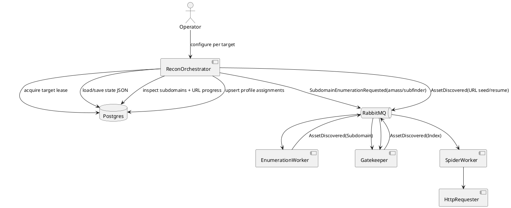

# SPEC-001-ReconOrchestrator

## Background

Argus Engine currently has independent workers for enumeration, HTTP request handling, spidering, technology identification, and related scan tasks. Recon needs a target-scoped control plane that can coordinate several workers, persist progress, resume safely, and keep request behavior consistent for each machine/IP and subdomain pair.

## Requirements

### Must

- Allow one active ReconOrchestrator per target.
- Persist serialized orchestrator state continuously.
- Record and request `subfinder` and `amass` enumeration when missing.
- Track subdomain spider progress and classify subdomains as `NotStarted`, `Resumable`, or `Complete`.
- Treat a subdomain as incomplete while URL assets remain unconfirmed.
- Generate and persist deterministic realistic header profiles by target, subdomain, and machine identity/IP.
- Use defaults requested for profile counts, rate limits, random delays, header order, devices, browsers, OS values, and hardware/software age.

### Should

- Use existing Argus contracts where possible.
- Avoid duplicating active work through target leases.
- Allow a replacement orchestrator instance to resume from persisted state.

### Could

- Expose an API for other workers to resolve profile headers at request time.
- Add provider completion consumers once enumeration emits explicit completion events.

### Won't in MVP

- Rewrite spider or HTTP requester internals.
- Add a new external scheduler dependency.

## Method

## Implementation

- Add `src/ArgusEngine.Workers.Orchestration`.
- Add durable tables:
  - `recon_orchestrator_states`
  - `recon_orchestrator_provider_runs`
  - `recon_orchestrator_subdomain_statuses`
  - `recon_orchestrator_profile_assignments`
- Add `ReconOrchestratorHostedService`.
- Add `ReconProfilePlanner` for deterministic profile generation.
- Publish `SubdomainEnumerationRequested` for missing providers.
- Publish URL seed/resume `AssetDiscovered` events for spidering.

## Milestones

1. Add project and schema.
2. Implement lease/state management.
3. Implement enumeration reconciliation.
4. Implement subdomain progress reconciliation.
5. Implement deterministic profiles and profile persistence.
6. Build and smoke-test against a dev database and RabbitMQ.

## Gathering Results

- Verify only one active lease exists per target.
- Confirm `amass` and `subfinder` provider rows are recorded before messages are published.
- Restart the orchestrator and verify state resumes.
- Confirm subdomain statuses transition from `NotStarted` to `Resumable` to `Complete`.
- Verify repeated runs for the same target/subdomain/IP generate the same profile ID, user agent, and header order.

## Need Professional Help in Developing Your Architecture?

Please contact me at [sammuti.com](https://sammuti.com) :)
